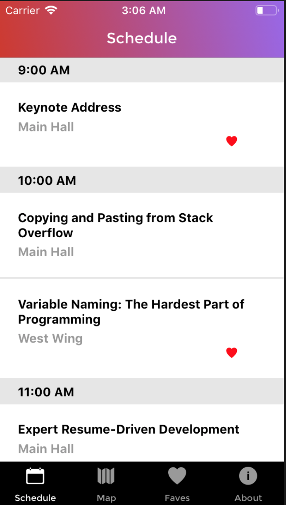
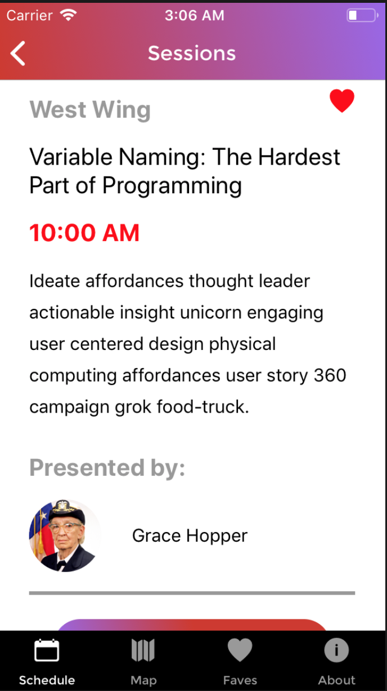
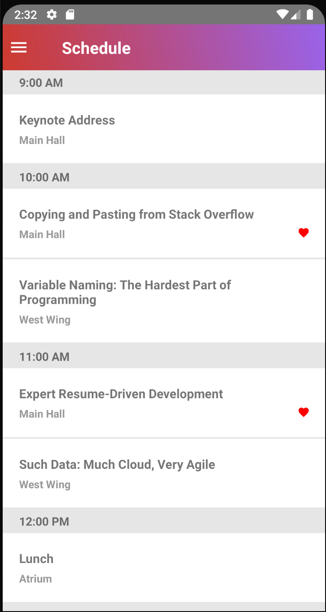
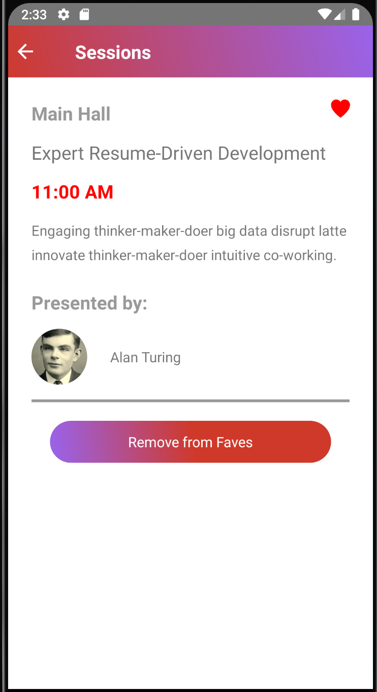

# R10

|                 iOS Schedule                 |                 iOs Sessions                 |
| :------------------------------------------: | :------------------------------------------: |
|  |  |

|               Android Schedule               |               Android Sessions               |
| :------------------------------------------: | :------------------------------------------: |
|  |  |

## Description

R10 is a React Native app that that helps users mark events from a schedule that which they desire to take part in.

## Setup

1. `git clone` this repo
2. Run `yarn install` or `yarn` in the project directory

To run on ios:

```bash
react-native run-ios
```

To run on Android, open emulator, then run:

```bash
react-native run-android
```

## Technologies Used

- React Native
- GraphQL
- Async Storage
- Apollo
- Node.js

XCode and Android Studio
